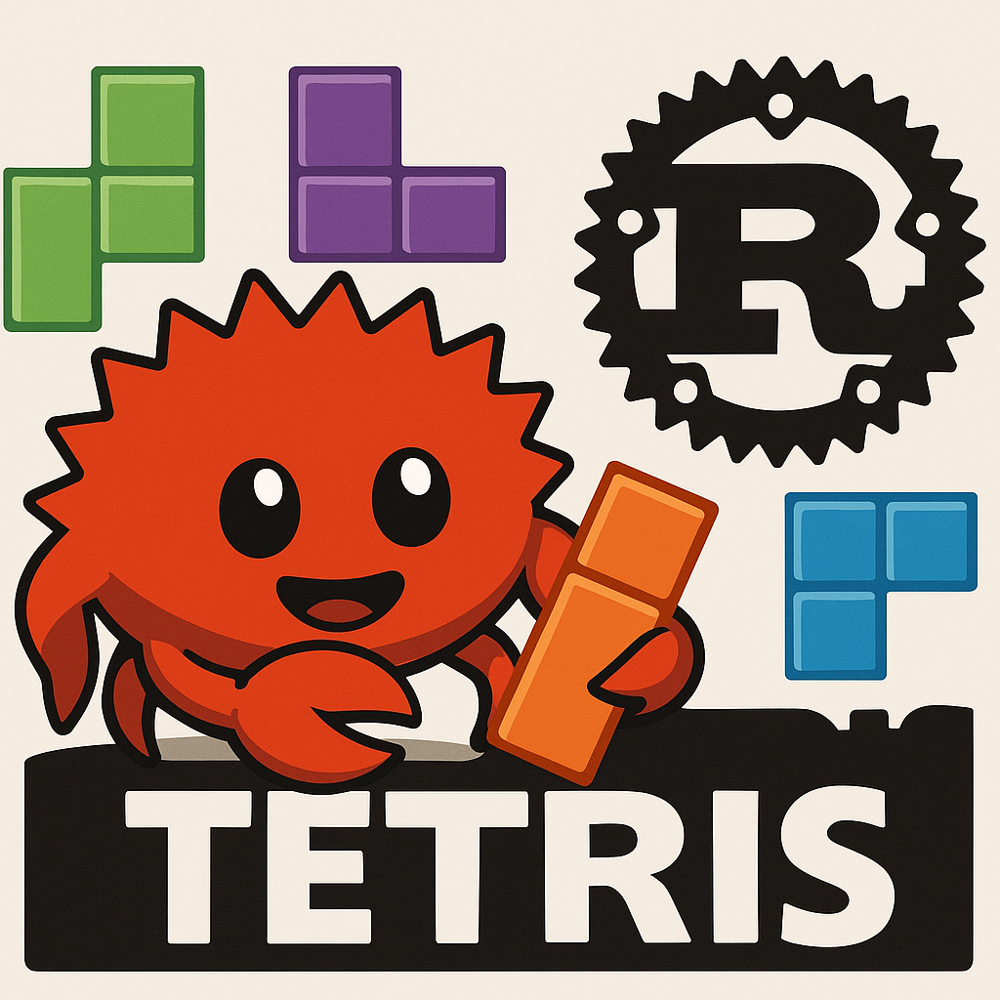

# tetris_rust

A simple Tetris game implemented in Rust. This project showcases the classic tile-matching puzzle game, leveraging Rust's safety and performance features.

Enjoy playing and exploring how Tetris can be built using the Rust programming language!
