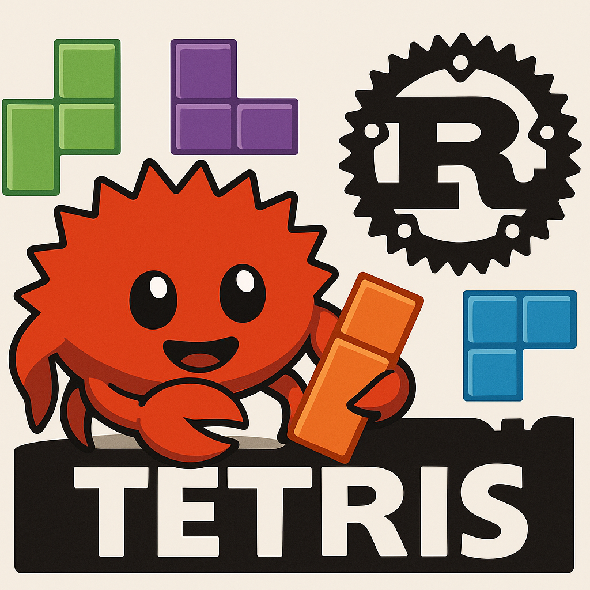

# tetris_rust



## Description

This is a simple Tetris game implemented in Rust. It features the classic tile-matching puzzle gameplay, leveraging Rust's safety and performance. The game includes smooth piece movement, rotation, line clearing, scoring, and audio playback.

## Libraries Used

- **macroquad**: For graphics, windowing, and input handling.
- **rodio**: For audio playback (background music).

## File Structure

```
src/
  main.rs                # Entry point and game loop
  core/
    board.rs             # Board logic and representation
    constants.rs         # Game constants (sizes, colors, etc.)
    game.rs              # Main game logic
    piece.rs             # Piece logic and movement
    point_2d.rs          # 2D point struct for positions
  enums/
    cell_type.rs         # Cell type enum
    direction.rs         # Movement direction enum
    game_state.rs        # Game state enum
    piece_type.rs        # Piece type enum
    rotation_direction.rs# Rotation direction enum
  ui/
    audio_player.rs      # Audio playback logic
    render_engine.rs     # Rendering functions
sounds/
  Tetris.mp3            # Background music
Tetris_Rust_logo.png    # Project logo
README.md               # This file
Cargo.toml              # Rust dependencies and metadata
```

## Game Controls

- **Left Arrow / A**: Move piece left
- **Right Arrow / D**: Move piece right
- **Up Arrow / W / X**: Rotate piece clockwise
- **Q / Z**: Rotate piece counter-clockwise
- **Down Arrow / S**: Soft drop (piece falls faster while held)
- **Space**: Hard drop (piece falls instantly)
- **Escape**: Quit game or close game over screen

## How to Run

Ensure you have Rust installed. Run the game with:

```
cargo run
```

Enjoy playing and exploring how Tetris can be built using the Rust programming language!
